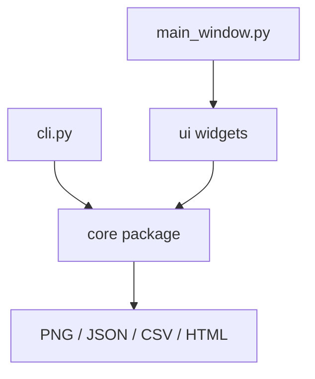

# Architecture

`core/` is pure Python and has no Qt imports. It owns image I/O wrappers, transform fitting, RANSAC, warping, coverage, export, JSON schemas, project files, batch processing, and report rendering.

`ui/` contains PyQt6 and pyqtgraph widgets. The GUI calls `core/` services and keeps long exports off the GUI thread through `ui.workers.ExportWorker`.

`cli.py` imports only `core/` for batch mode, so headless processing does not require constructing a QApplication.
